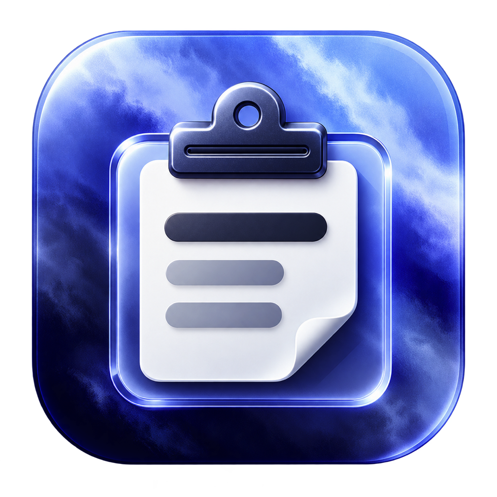
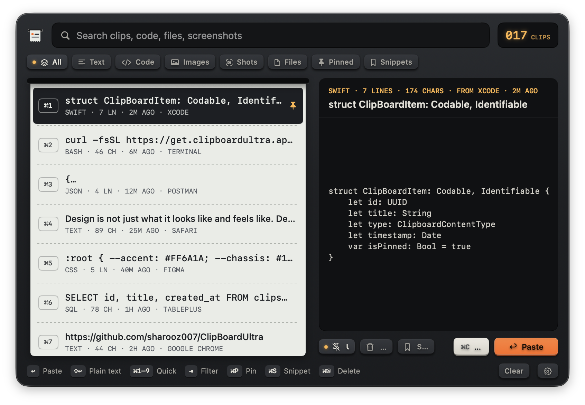
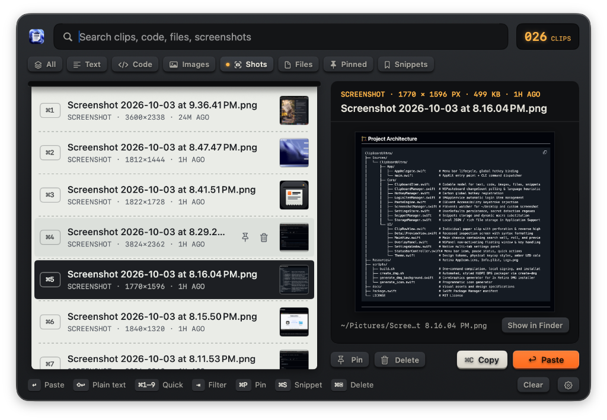
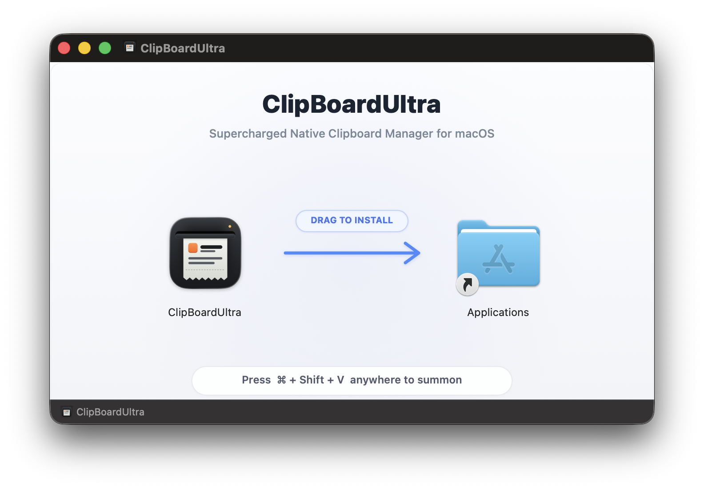

<div align="center">



# ClipBoardUltra

**A tactile, ultra-fast, keyboard-driven native clipboard manager for macOS.**

[](https://apple.com)
[](https://swift.org)
[]()
[](LICENSE)
[]()

<br />



<br />

*Press <kbd>⌥</kbd><kbd>⌘</kbd><kbd>V</kbd> anywhere, select your clip with arrow keys, and press <kbd>↩ Return</kbd> to paste directly into the active field.*

</div>

---

## ⚡ Overview

Most clipboard managers require taking your hands off the keyboard, clicking through multiple windows, or dealing with heavy web-based Electron wrappers that consume hundreds of megabytes of memory.

**ClipBoardUltra** is designed from the ground up as a native macOS instrument:
- **Instant Auto-Paste**: Simulates native keystrokes directly into your active editor, browser, or terminal without window focus fighting.
- **📸 Zero-Friction Screenshot Workflow**: Solves the notorious macOS disappearing-thumbnail problem. Screenshots are captured instantly in the background and can be pasted directly with <kbd>↩ Return</kbd>—no Finder searching required!
- **Physical Keycap Aesthetic**: Inspired by tactile desk instruments and Teenage Engineering hardware—perforated paper roll slips, keycaps with mechanical travel, amber LED readouts, and a dedicated safety-orange paste key.
- **100% Keyboard-Driven**: Seamlessly browse, filter, pin, format, and paste without ever touching your mouse.
- **Zero Latency, Pure Swift**: Built purely in Swift and AppKit. Uses under 35 MB of RAM and zero background CPU.
- **Privacy First**: 100% offline. Zero network calls, zero analytics. Secrets and passwords are automatically filtered out.

---

## 📸 The Problem: macOS's Disappearing Screenshot Thumbnail

Every Mac power user has experienced this frustration:

| The Default macOS Frustration ❌ | The ClipBoardUltra Solution ⚡ |
| :--- | :--- |
| **1.** You press <kbd>⌘</kbd><kbd>⇧</kbd><kbd>4</kbd> or <kbd>⌘</kbd><kbd>⇧</kbd><kbd>5</kbd> to grab a screenshot. | **1.** You capture your screenshot with any macOS shortcut. |
| **2.** A tiny thumbnail floats in the bottom-right corner for **just 2–3 seconds**. | **2.** ClipBoardUltra's background watcher catches the screenshot **the exact millisecond it is created**. |
| **3.** You switch windows or get distracted—**the thumbnail vanishes**. | **3.** Press <kbd>⌥</kbd><kbd>⌘</kbd><kbd>V</kbd> anywhere—your fresh capture is already at the very top. |
| **4.** Now you must open **Finder**, click **Desktop** or screenshots folder, hunt down `Screenshot 2026-10-03 at 9.45.12 PM.png`, and manually drag or copy it. | **4.** Press <kbd>↩ Return</kbd>—it is **instantly pasted** directly into Slack, Figma, Discord, GitHub, Notion, or email! |

> **No rushing before thumbnails disappear. No cluttered Desktop file hunting. No Finder drag-and-drop.**  
> Even if you captured multiple screenshots over the past hour, press <kbd>→</kbd> or <kbd>Tab</kbd> to jump straight into the **Screenshots** category to preview and paste any past screenshot instantly.

<br />

<div align="center">
  
  <br />
  <em>Auto-caught screenshots ready for instant inspection and pasting with <kbd>↩ Return</kbd>.</em>
</div>

---

## ✨ Features

### 🖨️ Physical Desk Instrument Aesthetic
- **Perforated Slip Roll**: Clipboard entries slide smoothly from a recessed chassis slot with dashed perforation dividers.
- **Mechanical Keycaps**: Tactile keycaps with physical travel and LED state indicators.
- **Amber LED Readouts**: Segmented displays showing total clip count and active metadata.
- **Single-Action Orange**: Dedicated safety-orange key reserved exclusively for paste confirmation.

### ⌨️ Comprehensive Keyboard Control
- **Quick Paste (⌘1–⌘9)**: Paste any of the first nine clips instantly with a single chord.
- **Category Switching**: Press <kbd>Tab</kbd> / <kbd>⇧Tab</kbd> or <kbd>←</kbd> <kbd>→</kbd> (when search is empty) to jump between *All*, *Text*, *Code*, *Images*, *Screenshots*, *Files*, *Pinned*, and *Snippets*.
- **Alternate Paste Modes**:
  - <kbd>↩</kbd> Paste formatted or default text.
  - <kbd>⇧↩</kbd> Paste plain text (stripping RTF/HTML styles).
  - <kbd>⌘↩</kbd> Copy to pasteboard without auto-pasting.

### 🧠 Intelligent Content Engine
- **📸 Automatic Screenshot Watcher & Instant Paste**: Watches your system screenshot folder (`com.apple.screencapture location` or Desktop) using native FSEvents. Whenever a screenshot is created, ClipBoardUltra ingests it in background. You can inspect its dimensions and timestamp in the right preview panel and paste the image data directly with <kbd>↩ Return</kbd>.
- **Syntax Language Detection**: Automatically parses and tags copied code (Swift, Python, TypeScript, Go, Rust, Shell, JSON, SQL, HTML/CSS).
- **Rich Text Preservation**: Keeps full RTF/HTML formatting intact alongside clean UTF-8 plain text.

### 📝 Dynamic Snippets
Save frequently used text templates (signatures, addresses, code snippets) with dynamic expansion macros:
- `{date}`, `{time}`, `{datetime}`, `{weekday}`
- `{clipboard}` (injects whatever is currently on your system clipboard)
- `{uuid}` (generates a fresh random UUID)
- `{cursor}` (places the text cursor precisely where you want it after pasting)

### 🛡️ Privacy & Secret Shield
- **Automatic Secret Filter**: Detects API tokens, bearer keys, private keys, and passwords to prevent accidental clipboard history pollution.
- **App Ignore List**: Exclude password managers (1Password, Bitwarden, KeePassXC) from history tracking.
- **Transient Pause**: Pause recording for 5 minutes, 1 hour, or indefinitely with a single click.

---

## 📸 Installer Preview

<div align="center">
  
  <br />
  <em>The release installer provides a pixel-perfect, HiDPI Retina drag-and-drop experience.</em>
</div>

---

## 🚀 Installation

### Option 1: Direct Download (Recommended)

1. Download the latest installer from [**Releases**](https://github.com/sharooz007/ClipBoardUltra/releases):
   - **`ClipBoardUltra.dmg`** — **Universal 2** installer (Recommended: runs natively on **both Apple Silicon & Intel Macs**).
   - **`ClipBoardUltra-Intel-x86_64.dmg`** — Dedicated package for **Intel Macs** (macOS 13+).
2. Open the disk image and drag **ClipBoardUltra** into your **Applications** folder.
3. Launch ClipBoardUltra.

### Option 2: Build from Source

Requirements: macOS 13+, Xcode Command Line Tools (`xcode-select --install`).

```bash
# Clone the repository
git clone https://github.com/sharooz007/ClipBoardUltra.git
cd ClipBoardUltra

# Compile, sign locally, install to /Applications and launch
./scripts/build.sh

# Or build the DMG installer
./scripts/create_dmg.sh
```

> **Accessibility Setup**: ClipBoardUltra requires **System Settings → Privacy & Security → Accessibility** to simulate the <kbd>⌘</kbd><kbd>V</kbd> paste keystroke into your target app. The build script signs the application with a stable local certificate so macOS remembers this permission across rebuilds.

---

## ⌨️ Shortcuts Reference

| Shortcut | Description |
| :--- | :--- |
| <kbd>⌥</kbd> <kbd>⌘</kbd> <kbd>V</kbd> | Summon or dismiss the ClipBoardUltra overlay *(customizable in Settings)* |
| <kbd>↑</kbd> / <kbd>↓</kbd> | Navigate clips |
| <kbd>↩ Return</kbd> | Paste selected clip into the active field |
| <kbd>⇧</kbd> <kbd>↩</kbd> | Paste alternative format *(plain text ⇄ original formatting)* |
| <kbd>⌘</kbd> <kbd>↩</kbd> | Copy only *(do not auto-paste)* |
| <kbd>⌘1</kbd> – <kbd>⌘9</kbd> | Instantly paste one of the top 9 items |
| <kbd>⌘</kbd> <kbd>C</kbd> | Copy selected item to system clipboard |
| <kbd>⌘</kbd> <kbd>P</kbd> | Pin / unpin selected clip |
| <kbd>⌘</kbd> <kbd>S</kbd> | Save clip as a reusable snippet |
| <kbd>⌘</kbd> <kbd>⌫</kbd> | Delete selected clip from history |
| <kbd>⇥ Tab</kbd> / <kbd>⇧⇥</kbd> | Cycle forward/backward through category filters |
| <kbd>←</kbd> / <kbd>→</kbd> | Cycle categories when search field is empty |
| <kbd>⌘</kbd> <kbd>,</kbd> | Open Settings window |
| <kbd>Esc</kbd> | Clear search query, or close overlay |

---

## 🏗️ Project Architecture

```
ClipBoardUltra/
├── Sources/
│   └── ClipBoardUltra/
│       ├── App/
│       │   ├── AppDelegate.swift       # Menu bar lifecycle, global hotkey binding
│       │   └── main.swift              # AppKit entry point + CLI command dispatcher
│       ├── Core/
│       │   ├── ClipboardItem.swift     # Codable model for text, code, images, files, snippets
│       │   ├── ClipboardManager.swift  # NSPasteboard changeCount polling & language heuristics
│       │   ├── HotkeyManager.swift     # Carbon global hotkey registration
│       │   ├── LoginItemManager.swift  # SMAppService automatic login item management
│       │   ├── PasteEngine.swift       # CGEvent Accessibility keystroke injection
│       │   ├── ScreenshotManager.swift # FSEvents watcher for ~/Desktop and custom screenshot dirs
│       │   ├── SettingsStore.swift     # UserDefaults persistence, secret detection regexes
│       │   ├── SnippetManager.swift    # Snippets storage and dynamic macro substitution
│       │   └── StorageManager.swift    # Local JSON / rich file storage in Application Support
│       └── UI/
│           ├── ClipRowView.swift       # Individual paper slip with perforation & reverse highlight
│           ├── DetailPreviewView.swift # Recessed inspection screen with syntax formatting
│           ├── MainView.swift          # Main chassis containing search well, roll, and preview
│           ├── OverlayPanel.swift      # NSPanel non-activating floating window & key handling
│           ├── SettingsWindow.swift    # Native multi-tab settings panel
│           ├── StatusBarController.swift# Menu bar icon, pause status, quick actions
│           └── Theme.swift             # Design tokens, physical keycap styles, amber LED colors
├── Resources/                          # Retina AppIcon.icns, Info.plist, Logo.png
├── scripts/
│   ├── build.sh                        # One-command compilation, local signing, and installation
│   ├── create_dmg.sh                   # Automated, styled HiDPI DMG packager via create-dmg
│   ├── generate_dmg_background.swift   # CoreGraphics generator for 2x Retina DMG installer
│   └── generate_icon.swift             # Programmatic icon generator
├── docs/                               # Visual assets and design specifications
├── Package.swift                       # Swift Package Manager manifest
└── LICENSE                             # MIT License
```

---

## 🔒 Privacy & Permissions

- **Zero Telemetry**: No crash reports, no analytics, no external network requests.
- **Local Storage**: All history is stored under `~/Library/Application Support/ClipBoardUltra/`.
- **Minimal Permissions**: ClipBoardUltra only asks for **Accessibility** (to emit synthetic paste keystrokes). It never asks for Full Disk Access, Camera, or Screen Recording.

---

## 🤝 Contributing

Contributions, feature suggestions, and bug reports are welcome! Please check out [CONTRIBUTING.md](CONTRIBUTING.md) to get started.

---

## 📄 License

ClipBoardUltra is licensed under the [MIT License](LICENSE).
Created with care by [Sharooz](https://github.com/sharooz007).
